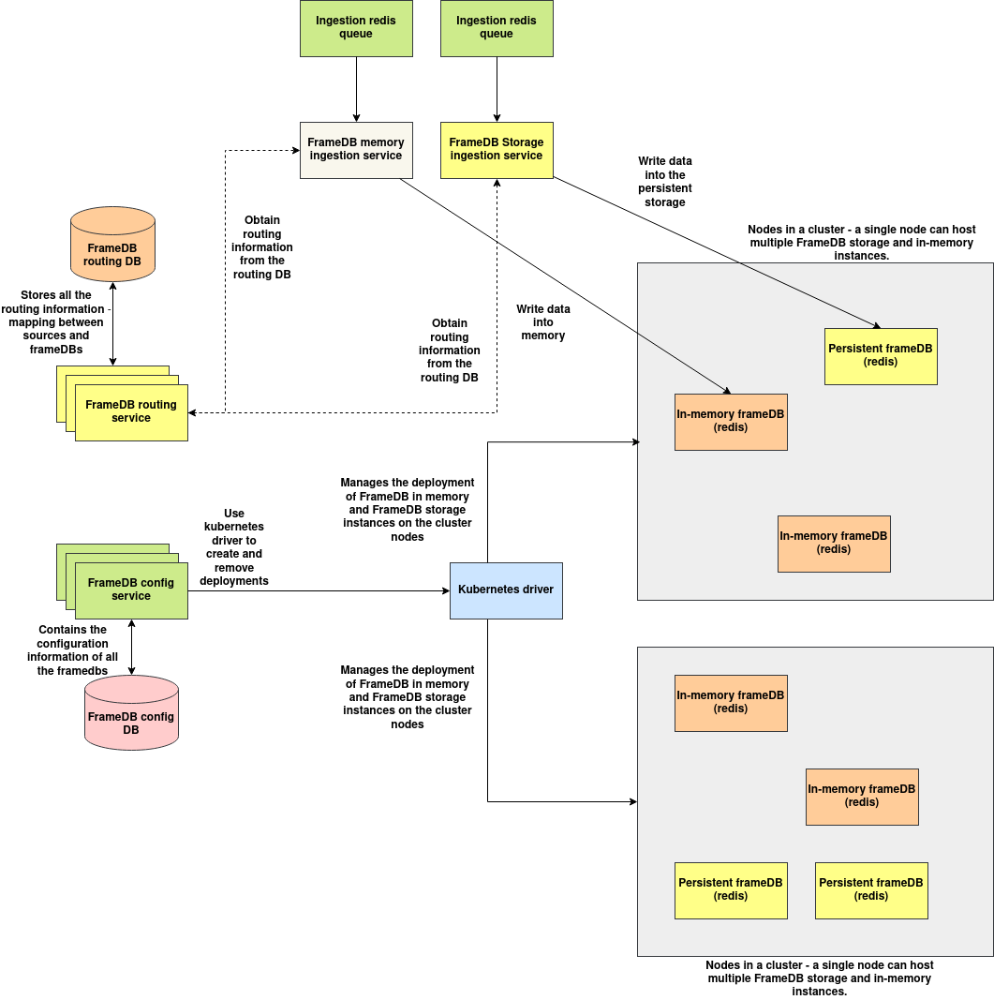

# MemoryGrid

**Note: This documentation is a work in progress.**

MemoryGrid is a distributed data store designed to store large files/binary data locally on a collection of nodes. It forms a core part of the architecture, enabling large data—such as videos, high-resolution images, or extensive text corpora—to be ingested into the local node's database. This data can later be retrieved by the processing instance as needed.

MemoryGrid supports in-memory as well as persistent storage.

For MemoryGrid in-memory operation - Redis is used internally and for persistent storage TiDB is used.

## Features:

1. A easy to use in-memory and persistent storage system powered by redis and TiDB.

2. APIs to create and manage instances of both persistent storage and in memory instances.

3. APIs to write and read data from any frame-db instance provided its ID irrespective of whether its in memory or storage.

---

## Architecture

### Components:

**1. MemoryGrid config service**: MemoryGrid config service is responsible for maintaining the configuration of MemoryGrid deployments and also provides necessary kubernetes integrations to deploy the MemoryGrid deployments on the target nodes of the cluster.

**2. Kubernetes drivers**: Kubernetes drivers provides necessary code to deploy MemoryGrid deployments on the target cluster, it is integrated with the MemoryGrid config service and acts on the commands of the MemoryGrid config service.

**3. MemoryGrid routing service**: MemoryGrid routing service contains the mapping of MemoryGrid ID, MemoryGrid storage instance's URL mapping, this mapping can be referenced by several services that integrates with MemoryGrid, provided the MemoryGrid IP the routing service provides the URL of the service within the cluster.

**4. MemoryGrid Ingestion services**: MemoryGrid ingestion services are responsible for ingesting data from outside and writing the contents to the target MemoryGrid instance. MemoryGrid ingestion services are available both for in-memory and persistent storage.

**5. MemoryGrid instances**: MemoryGrid instances are used to store the data written into the MemoryGrids, services that reads the data from MemoryGrid are connected directly to these DBs for fast reading without a proxy by resolving the URL from the routing service. There are two types of MemoryGrid instances:

**a. MemoryGrid in-memory instances**: These are redis instances that store data in memory, backup is disabled by default which can be enabled if needed. The deployments of MemoryGrid in-memory instances can be deployed in replica mode with quorum configured to enable replication. A **MemoryGrid Cluster** is a collection of the master redis node, the redis sentinels and the replica worker nodes. It is possible to deploy any number of MemoryGrid clusters on a single kubernetes cluster node.

**b. MemoryGrid persistence instances**: Powered by TiDB, however there are plans to use a different DB in the future, when deploying TiDB instances, it is possible to configure storage size, replication and DB parameters. 

