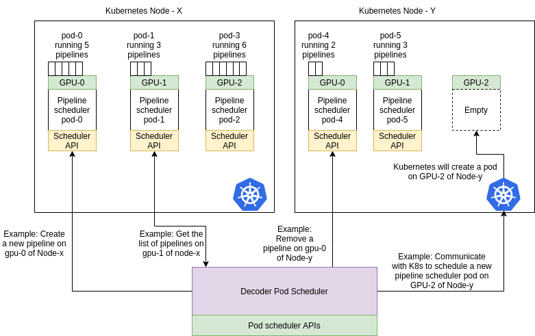

# Video Ingestion

MemoryGrid supports video ingestion through **GStreamer**, an external system built on top of MemoryGrid.

## Architecture



The **Decoder Scheduler** creates and manages video decoding pipelines on Kubernetes. The video decoding architecture is organized into two primary components:

---

### 1. Decoder Pod Scheduler

The Decoder Pod Scheduler is responsible for deploying and managing decoder pods across Kubernetes cluster nodes. It interacts directly with the Kubernetes API and provides the following REST APIs:

* **Create** a decoder pod
* **Destroy** a decoder pod
* **List** all active decoder pods

Each decoder pod created by this service runs a **Decoding Pipeline Scheduler**, which exposes its own web server for managing individual video pipelines.

---

### 2. Decoding Pipeline Scheduler

Each pod managed by the Decoder Pod Scheduler acts as a **Pipeline Scheduler**, capable of managing multiple decoding pipelines based on the node’s available CPU and GPU resources. The responsibilities of the Pipeline Scheduler include:

* Running a web service to handle **pipeline creation and removal requests**.
* Launching each pipeline as a **separate process** inside the pod.
* Maintaining an internal mapping of **process IDs (PIDs)** to **source IDs**.
* Terminating pipelines by killing the corresponding PID upon receiving a removal request.

---

### Overall Flow

The diagram above illustrates the full architecture of the video decoding system in **AIOS**:

* The **Decoder Pod Scheduler** deploys Pipeline Scheduler pods to the appropriate GPU-enabled nodes.
* Each **Pipeline Scheduler** pod manages the lifecycle of multiple pipelines, running them as independent processes.
* These pods expose APIs to **create, list, and remove** individual pipelines.
* All Pipeline Scheduler pods are orchestrated and managed by the Decoder Pod Scheduler, which handles communication with the Kubernetes cluster.

---

### API Usage

The decoder system exposes a set of APIs, but **direct usage by end users is not recommended**, as these APIs require numerous configuration parameters. Instead, the **AIOS Master DAG Controller** handles:

* Dynamic creation and management of decoder pipelines
* Configuration updates based on workload and video stream metadata

However, **read-only APIs** (such as listing pipelines) may be used externally for monitoring and querying purposes.

---

## Creating GStreamer Ingestion Pods

MemoryGrid supports dynamic creation and removal of GStreamer ingestion pods via a Decoder Pod Scheduler. These pods run decoding pipelines on GPU-enabled Kubernetes nodes. The APIs interact with the Kubernetes cluster to create or remove decoding pods and their associated services.

---

### 1. **POST** `/createInstance`

Creates a new decoder pod and its associated Kubernetes service on the specified node and GPU.

#### **Description**

This API provisions a GStreamer ingestion pod on a target node and GPU by creating a Kubernetes Deployment and a corresponding Service. The pod runs a decoding pipeline scheduler which can later be queried or controlled via other APIs.

#### **Request Payload**

```json
{
  "node": "<NODE_NAME>",
  "gpuID": "<GPU_ID>"
}
```

* `node` (string): The name of the Kubernetes node on which the pod should be scheduled.
* `gpuID` (string or int): The GPU ID on the node where the decoder pod should be attached.

#### **Response**

```json
{
  "success": true,
  "payload": {
    "service_create_result": "Created service successfully",
    "pod_create_result": "Created pod successfully"
  }
}
```

If an error occurs:

```json
{
  "success": false,
  "payload": "Error message"
}
```

#### **cURL Example**

```bash
curl -X POST http://<HOST>:5000/createInstance \
  -H "Content-Type: application/json" \
  -d '{
    "node": "node-1",
    "gpuID": "0"
  }'
```

---

### 2. **POST** `/removeInstance`

Removes an existing decoder pod and its Kubernetes service from the specified node and GPU.

#### **Description**

This API deletes the Kubernetes Deployment and Service associated with the decoder pod running on the specified node and GPU. It performs a graceful termination of the pod using foreground deletion.

#### **Request Payload**

```json
{
  "node": "<NODE_NAME>",
  "gpuID": "<GPU_ID>"
}
```

* `node` (string): The name of the Kubernetes node where the decoder pod is deployed.
* `gpuID` (string or int): The GPU ID associated with the pod to be deleted.

#### **Response**

```json
{
  "success": true,
  "payload": {
    "service_remove_result": "Removed service successfully",
    "pod_remove_result": "Remove pod successfully"
  }
}
```

If an error occurs:

```json
{
  "success": false,
  "payload": "Error message"
}
```

#### **cURL Example**

```bash
curl -X POST http://<HOST>:5000/removeInstance \
  -H "Content-Type: application/json" \
  -d '{
    "node": "node-1",
    "gpuID": "0"
  }'
```

---

## Creating Video Ingestion pipelines


These APIs delegate control operations (query, start, restart) to individual **Pipeline Scheduler pods**, which are exposed via Kubernetes Services. These services are dynamically constructed using the format:

```
http://decoder-<node>-gpu-<gpuID>-svc.framedb-storage.svc.cluster.local:5000
```

---

### 3. **POST** `/queryHealth`

Fetches the health status of the decoder pod on the specified node and GPU.

#### **Request Payload**

```json
{
  "node": "<NODE_NAME>",
  "gpuID": "<GPU_ID>"
}
```

#### **Response**

```json
{
  "success": true,
  "payload": {
    "status": "healthy",
    "uptime": "17300s",
    "version": "v1.2.3"
  }
}
```

#### **cURL Example**

```bash
curl -X POST http://<HOST>:5000/queryHealth \
  -H "Content-Type: application/json" \
  -d '{"node": "node-1", "gpuID": "0"}'
```

---

### 4. **POST** `/querySources`

Returns a list of all active decoding streams (pipelines) running on the specified decoder pod.

#### **Request Payload**

```json
{
  "node": "<NODE_NAME>",
  "gpuID": "<GPU_ID>"
}
```

#### **Response**

```json
{
  "success": true,
  "payload": [
    {
      "jobName": "camera01-decoder",
      "config": {
        "uri": "rtsp://example.com/stream1",
        "codec": "h264"
      }
    },
    {
      "jobName": "camera02-decoder",
      "config": {
        "uri": "rtsp://example.com/stream2",
        "codec": "h265"
      }
    }
  ]
}
```

#### **cURL Example**

```bash
curl -X POST http://<HOST>:5000/querySources \
  -H "Content-Type: application/json" \
  -d '{"node": "node-1", "gpuID": "0"}'
```

---

### 5. **POST** `/restartSource`

Restarts a specific stream by first killing and then recreating the decoding job using the previously stored configuration.

#### **Request Payload**

```json
{
  "node": "<NODE_NAME>",
  "gpuID": "<GPU_ID>",
  "sourceId": "<SOURCE_ID>"
}
```

* The job name is derived internally as: `<SOURCE_ID>-decoder`.

#### **Response**

```json
{
  "success": true,
  "payload": "Stream source-1 restarted successfully"
}
```

#### **cURL Example**

```bash
curl -X POST http://<HOST>:5000/restartSource \
  -H "Content-Type: application/json" \
  -d '{
    "node": "node-1",
    "gpuID": "0",
    "sourceId": "camera01"
  }'
```

---

### 6. **POST** `/startWithContext`

Starts a new decoding pipeline with full configuration context.

#### **Request Payload**

```json
{
  "node": "<NODE_NAME>",
  "gpuID": "<GPU_ID>",
  "sourceId": "<SOURCE_ID>",
  "config": {
    
  }
}
```

* Internally constructs a job name: `<SOURCE_ID>-decoder`
* Wraps the config under `jobParameters.settings.sourceInfo`

#### **Response**

```json
{
  "success": true,
  "payload": "Stream started with context"
}
```

#### **cURL Example**

```bash
curl -X POST http://<HOST>:5000/startWithContext \
  -H "Content-Type: application/json" \
  -d '{
    "node": "node-1",
    "gpuID": "0",
    "sourceId": "camera01",
    "config": {}
  }'
```

---

### 7. **POST** `/restartWithContext`

Performs a complete restart of a decoding pipeline using the supplied configuration.

#### **Request Payload**

Same structure as `/startWithContext`.

#### **Behavior**

1. Constructs the job name (`<sourceId>-decoder`)
2. Sends a `POST /killStream` request to terminate the job
3. Waits for 5 seconds
4. Sends a `POST /createStream` request with the context payload

#### **Response**

```json
{
  "success": true,
  "payload": "Stream restarted with context"
}
```

#### **cURL Example**

```bash
curl -X POST http://<HOST>:5000/restartWithContext \
  -H "Content-Type: application/json" \
  -d '{
    "node": "node-1",
    "gpuID": "0",
    "sourceId": "camera01",
    "config": {}
  }'
```

---

## Source Registry

The **Source Registry** is a central metadata store for video sources. It manages metadata for **live** (ONVIF, RTSP, etc.) and **offline** (archived) video feeds. Each source is associated with a unique `sourceID` and can be grouped under a `groupID`.

Sources may include parameters like:

* Video encoding format
* Frame resolution and FPS
* Stream or storage paths
* Optional ONVIF credentials and calibration metadata
* Optional geospatial location via `geoJson`

This registry is useful for video ingestion pipelines, computer vision workflows, or distributed video analytics systems.

---

### Schema

Here is the revised schema explanation table using **"Yes"** or **"No"** for the **Required** column, with no emojis:

---

### Source Registry Schema Explanation

| **Field**             | **Type** | **Required** | **Description**                                                 |
| --------------------- | -------- | ------------ | --------------------------------------------------------------- |
| `sourceID`            | String   | Yes          | Unique identifier for the video source.                         |
| `groupID`             | String   | Yes          | Identifier used to group related sources.                       |
| `label`               | String   | Yes          | Human-readable name or label for the source.                    |
| `description`         | String   | No           | Optional textual description of the source.                     |
| `sourceType`          | String   | Yes          | Type of source: for example, `live` or `offline`.               |
| `liveSourceInfo`      | Object   | No           | Metadata and connection details for live sources.               |
| `offlineVideo`        | Object   | No           | Metadata and storage details for offline video files.           |
| `sourceMetadata`      | Object   | No           | Metadata such as frame properties and calibration data.         |
| └─ `frameProperties`  | Object   | Yes          | Video frame dimensions and encoding format.                     |
|   └─ `width`          | Number   | Yes          | Width of the video frame in pixels.                             |
|   └─ `height`         | Number   | Yes          | Height of the video frame in pixels.                            |
|   └─ `encodingFormat` | String   | No           | Optional encoding format (e.g., H.264).                         |
| └─ `calibrationData`  | Mixed    | No           | Optional calibration parameters (camera configuration, etc.).   |
| `alerts`              | Mixed    | No           | Optional alerting or event metadata associated with the source. |

---

### `liveSourceInfo` Subschema

| **Field**          | **Type** | **Required** | **Description**                              |
| ------------------ | -------- | ------------ | -------------------------------------------- |
| `protocol`         | String   | Yes          | Streaming protocol (e.g., RTSP, ONVIF).      |
| `streamURL`        | String   | Yes          | URL of the video stream.                     |
| `onvifURL`         | String   | Yes          | URL for ONVIF device interface.              |
| `onvifAuthInfo`    | Mixed    | No           | Optional ONVIF authentication credentials.   |
| `isOnvifAuth`      | Boolean  | Yes          | Indicates whether ONVIF auth is required.    |
| `streamParameters` | Object   | Yes          | Details about the stream format.             |
| └─ `codec`         | String   | Yes          | Codec used for video encoding (e.g., H.264). |
| └─ `fps`           | Number   | Yes          | Frames per second of the live stream.        |
| └─ `bitrate`       | Number   | No           | Optional bitrate of the stream.              |
| `geoJson`          | Mixed    | No           | Optional geolocation data in GeoJSON format. |

---

### `offlineVideo` Subschema

| **Field**          | **Type** | **Required** | **Description**                               |
| ------------------ | -------- | ------------ | --------------------------------------------- |
| `container`        | String   | Yes          | Video file container format (e.g., mp4, mkv). |
| `storageVideoPath` | String   | Yes          | Path or URI to the stored video file.         |
| `videoParameters`  | Object   | Yes          | Video encoding and playback properties.       |
| └─ `codec`         | String   | Yes          | Codec used for the stored video.              |
| └─ `fps`           | Number   | Yes          | Frames per second.                            |
| └─ `bitrate`       | Number   | No           | Optional video bitrate.                       |
| `geoJson`          | Mixed    | No           | Optional geolocation data in GeoJSON format.  |

---

### Base URL

```
POST http://<host>:<port>/api/source
Content-Type: application/json
```

---

## API Endpoints

### 1. Check if Source Exists

**`POST /sourceExists`**

Checks if a source with a given `sourceID` exists in the registry.

#### Request:

```json
{
  "sourceID": "camera-001"
}
```

#### cURL:

```bash
curl -X POST http://localhost:3000/api/source/sourceExists \
-H "Content-Type: application/json" \
-d '{"sourceID": "camera-001"}'
```

#### Response:

```json
{
  "error": false,
  "payload": { ...source document... }
}
```

---

### 2. Create New Source

**`POST /createNew`**

Creates a new source if it doesn't already exist.

#### Request:

```json
{
  "sourceID": "camera-001",
  "groupID": "group-A",
  "label": "Main Gate Cam",
  "sourceType": "LIVE",
  "liveSourceInfo": {
    "protocol": "RTSP",
    "streamURL": "rtsp://example.com/live",
    "onvifURL": "http://example.com/onvif",
    "isOnvifAuth": false
  }
}
```

#### cURL:

```bash
curl -X POST http://localhost:3000/api/source/createNew \
-H "Content-Type: application/json" \
-d @new-source.json
```

#### Response:

```json
{
  "error": false,
  "payload": { ...created source... }
}
```

---

### 3. ✏️ Update Existing Source

**`POST /updateSource`**

Updates the fields of an existing source using `sourceID`.

#### Request:

```json
{
  "sourceID": "camera-001",
  "data": {
    "label": "Updated Label",
    "description": "Camera updated"
  }
}
```

#### cURL:

```bash
curl -X POST http://localhost:3000/api/source/updateSource \
-H "Content-Type: application/json" \
-d @update-source.json
```

#### Response:

```json
{
  "error": false,
  "payload": {
    "acknowledged": true,
    "modifiedCount": 1,
    "matchedCount": 1
  }
}
```

---

### 4. Get Source by SourceID

**`POST /getBySourceID`**

Returns the source document(s) with the specified `sourceID`.

#### Request:

```json
{
  "sourceID": "camera-001"
}
```

#### cURL:

```bash
curl -X POST http://localhost:3000/api/source/getBySourceID \
-H "Content-Type: application/json" \
-d '{"sourceID": "camera-001"}'
```

---

### 5. Get All Sources by Group

**`POST /getSourcesByGroup`**

Fetches all sources belonging to a given `groupID`.

#### Request:

```json
{
  "groupID": "group-A"
}
```

#### cURL:

```bash
curl -X POST http://localhost:3000/api/source/getSourcesByGroup \
-H "Content-Type: application/json" \
-d '{"groupID": "group-A"}'
```

---

### 6. Query Sources

**`POST /query`**

Perform arbitrary MongoDB-style queries on the source registry.

#### Request:

```json
{
  "query": {
    "sourceType": "LIVE",
    "groupID": "group-A"
  }
}
```

#### cURL:

```bash
curl -X POST http://localhost:3000/api/source/query \
-H "Content-Type: application/json" \
-d @query.json
```

---

### Remove by SourceID

**`POST /removeBySourceID`**

Deletes all documents with the given `sourceID`.

#### Request:

```json
{
  "sourceID": "camera-001"
}
```

#### cURL:

```bash
curl -X POST http://localhost:3000/api/source/removeBySourceID \
-H "Content-Type: application/json" \
-d '{"sourceID": "camera-001"}'
```

---

### 8. Remove by GroupID

**`POST /removeByGroupID`**

Deletes all sources that belong to the specified `groupID`.

#### Request:

```json
{
  "groupID": "group-A"
}
```

#### cURL:

```bash
curl -X POST http://localhost:3000/api/source/removeByGroupID \
-H "Content-Type: application/json" \
-d '{"groupID": "group-A"}'
```

---

## GStreamer ingestion pod

### Overview

MemoryGrid's video decoding infrastructure uses **GStreamer (GST)** to dynamically construct and run multimedia pipelines for **live streams** and **stored videos**. Decoder pods are deployed on GPU-enabled Kubernetes nodes. Each pod launches decoding pipelines as independent processes and is orchestrated by a central Decoder Scheduler.

This document provides a complete overview of:

* What a GStreamer pipeline is
* The role and behavior of the `run_task()` function
* Accepted configuration parameters and their effect on pipeline construction
* How decoder pipelines are assembled for different video sources

---

### 1. What is a GStreamer Pipeline?

A **GStreamer pipeline** is a string-based description of connected multimedia components, called *elements*, that process media data in stages. For example:

```bash
gst-launch-1.0 filesrc location=video.mp4 ! decodebin ! autovideosink
```

In this command:

* `filesrc` reads a media file
* `decodebin` automatically detects the format and decodes it
* `autovideosink` displays the video

MemoryGrid dynamically assembles such pipelines based on source metadata and user configurations, optimizing for GPU or CPU-based decoding.

---

### 2. `run_task()` Entry Function

The `run_task()` function is the execution entrypoint inside each decoder pod. It performs the following high-level steps:

1. **Reads and parses the input config** from `env_settings.source_data`
2. **Validates** required fields and their types
3. Based on the `mode` parameter, launches either:

   * `LiveDecoder` – for RTSP/live sources
   * `StoredVideoDecoder` – for file-based stored video

---

## 3. Configuration Parameters

The `run_task()` function accepts a JSON payload via the environment variable `env_settings.source_data`. This payload is a dictionary of parameters used for pipeline construction, routing, metadata fetching, and runtime behavior.

Below is a table listing the supported configuration parameters.

### Decoder Input Parameters

| **Parameter**              | **Type** | **Required** | **Description**                                                             |
| -------------------------- | -------- | ------------ | --------------------------------------------------------------------------- |
| `source_id`                | String   | Yes          | Unique identifier for the stream/video source.                              |
| `mode`                     | String   | Yes          | Specifies decoding mode. Allowed: `"live"` or `"video"`.                    |
| `url`                      | String   | Yes          | RTSP URL or file path to the input video source.                            |
| `routing_url`              | String   | Yes          | Base URL of the MemoryGrid API to query node mappings.                         |
| `routing_api`              | String   | Yes          | API path appended to `routing_url` to perform routing query.                |
| `use_gpu`                  | Boolean  | Yes          | Use GPU-accelerated decoding (`nvh264dec`, `nvjpegdec`) or fallback to CPU. |
| `container`                | String   | No           | Required only for stored videos. Allowed: `"mp4"`, `"mkv"`, `"flv"`.        |
| `loop_video`               | Boolean  | Yes          | Whether to loop the video endlessly.                                        |
| `duration`                 | Integer  | Yes          | Total duration in seconds to run the decoding job.                          |
| `color_format`             | String   | Yes          | Output video color format. Example: `"RGB"`, `"BGR"`.                       |
| `update_counter`           | Integer  | Yes          | Frequency of update messages to MemoryGrid.                                    |
| `frame_quality`            | Integer  | Yes          | JPEG/PNG quality for output frames (0–100).                                 |
| `retry_interval`           | Integer  | Yes          | Retry wait time in seconds after decoding failure.                          |
| `updates_url`              | String   | Yes          | Redis or MemoryGrid update channel URL.                                        |
| `updates_port`             | Integer  | Yes          | Port used to send update messages.                                          |
| `updates_password`         | String   | Yes          | Password to authenticate update channel access.                             |
| `is_sentinel`              | Boolean  | Yes          | Whether Redis uses sentinel-based configuration.                            |
| `act_svc`                  | String   | Yes          | Hostname of the actuation controller.                                       |
| `act_port`                 | Integer  | Yes          | Port of the actuation controller.                                           |
| `act_password`             | String   | Yes          | Password for actuation controller access.                                   |
| `fps_checker_max_interval` | Integer  | No           | Maximum time in seconds for FPS validation. Default: `30`.                  |
| `fps_checker_min_frames`   | Integer  | No           | Minimum frame count to validate FPS. Default: `5`.                          |
| `enable_fps_checker`       | Boolean  | No           | Whether to enable internal framerate validation.                            |
| `use_custom_ts`            | Boolean  | No           | Manually add timestamps to stored video output.                             |
| `as_live`                  | Boolean  | No           | Treat stored video as live for encoder compatibility.                       |

---

### 4. Decoder Pipeline Construction

Based on the input parameters, the decoding pipeline is assembled in three major stages:

#### A. Decoder Unit

This part fetches the source and decodes it into raw frames.

| Source Mode      | Pipeline Snippet Example                                          |
| ---------------- | ----------------------------------------------------------------- |
| `live` (RTSP)    | `rtspsrc location="<url>" ! rtph264depay ! h264parse ! nvh264dec` |
| `video` (Stored) | `filesrc location="<file>" ! qtdemux ! h264parse ! nvh264dec`     |

#### B. Branch Unit

This section prepares the decoded video for resizing, color conversion, and batching.

| Mode | Snippet                                                                                    |
| ---- | ------------------------------------------------------------------------------------------ |
| GPU  | `cudaupload ! cudaconvert ! video/x-raw(memory:CUDAMemory), format=<color> ! cudadownload` |
| CPU  | `videoconvert ! video/x-raw, format=<color>`                                               |

### C. Encoder Unit

Final stage that either batches, streams, or writes the output to MemoryGrid.

| Mode           | Snippet                    |
| -------------- | -------------------------- |
| Stored video   | `video_writer`             |
| Live - batched | `video_batcher name=mixer` |
| Raw sink       | `tidbsink name=mixer`      |

---

### 5. Environment Export to GStreamer (`FRAMEDB_C`)

A JSON blob named `FRAMEDB_C` is constructed and injected into the environment of the decoding process. This environment contains:

* Target resolutions
* Skip frame thresholds
* Actuation metadata
* Redis update configuration
* Color formatting and quality
* MemoryGrid routing references

This environment is used by internal MemoryGrid GStreamer plugins to perform intelligent encoding, storage, and routing decisions.

---

### 6. Example Input Configuration

Here is an example `source_data` input for a stored video pipeline:

```json
{
  "source_id": "camera01",
  "mode": "video",
  "url": "/mnt/videos/sample.mp4",
  "container": "mp4",
  "routing_url": "http://framedb-router:5000",
  "routing_api": "/getMapping",
  "use_gpu": true,
  "loop_video": true,
  "duration": 600,
  "color_format": "RGB",
  "update_counter": 10,
  "frame_quality": 90,
  "retry_interval": 60,
  "updates_url": "redis://updates.framedb",
  "updates_port": 6379,
  "updates_password": "abc123",
  "is_sentinel": false,
  "act_svc": "actuation.framedb",
  "act_port": 9000,
  "act_password": "xyz123"
}
```

---

## GStreamer pipeline structure

MemoryGrid dynamically constructs GStreamer pipelines based on source type (stored or live), codec, hardware capabilities (GPU/CPU), and downstream requirements. The final pipeline is composed of three logical sections:

1. **Decoder Unit** – Fetches and decodes video input
2. **Branch Unit** – Processes decoded frames (resizing, color format, scaling)
3. **Encoder Unit** – Sends frames to the MemoryGrid sink

---

### A. Final Pipeline: **Stored Video**

#### Example (GPU-enabled, H264, MP4):

```bash
filesrc location="/videos/sample.mp4" ! qtdemux ! h264parse ! nvh264dec ! fps_checker ! videorate ! "video/x-raw, framerate=(fraction)8/1" ! cudaupload ! cudaconvert ! "video/x-raw(memory:CUDAMemory), format=RGB" ! cudadownload ! video_writer
```

#### Plugin-by-Plugin Explanation:

| Plugin                                       | Description                                                             |
| -------------------------------------------- | ----------------------------------------------------------------------- |
| `filesrc location=...`                       | Reads the video file from local filesystem.                             |
| `qtdemux`                                    | Demultiplexes MP4 container into audio/video streams.                   |
| `h264parse`                                  | Parses raw H.264 byte stream to extract frames and metadata.            |
| `nvh264dec`                                  | NVIDIA GPU-based decoder for H.264 streams.                             |
| `fps_checker` *(optional)*                   | Custom plugin that validates if incoming FPS is within expected bounds. |
| `videorate`                                  | Regulates frame rate by dropping/duplicating frames as needed.          |
| `video/x-raw, framerate=(fraction)8/1`       | Caps filter enforcing target output frame rate (e.g., 8 FPS).           |
| `cudaupload`                                 | Uploads CPU video frames to GPU memory.                                 |
| `cudaconvert`                                | Converts format/colorspace within GPU (e.g., NV12 → RGB).               |
| `video/x-raw(memory:CUDAMemory), format=RGB` | Applies GPU memory layout and output format.                            |
| `cudadownload`                               | Downloads processed video frames from GPU to CPU.                       |
| `video_writer`                               | Custom plugin that encodes/writes output to MemoryGrid in stored mode.     |

---

### B. Final Pipeline: **Live Video Stream**

#### Example (GPU-enabled, MJPEG via RTSP):

```bash
rtspsrc protocol=tcp location="rtsp://camera" latency=10 ! rtpjpegdepay ! jpegparse ! nvjpegdec ! fps_checker ! videorate ! "video/x-raw, framerate=(fraction)8/1" ! cudaupload ! cudaconvert ! "video/x-raw(memory:CUDAMemory), format=BGR" ! cudadownload ! tee name=t t. ! queue ! mixer.
```

#### Plugin-by-Plugin Explanation:

| Plugin                                       | Description                                                                             |
| -------------------------------------------- | --------------------------------------------------------------------------------------- |
| `rtspsrc protocol=tcp location=...`          | Fetches video from a remote RTSP stream using TCP.                                      |
| `latency=10`                                 | Buffers 10ms worth of data to smooth out jitter.                                        |
| `rtpjpegdepay`                               | Extracts JPEG payloads from RTP packets.                                                |
| `jpegparse`                                  | Parses JPEG stream and prepares it for decoding.                                        |
| `nvjpegdec`                                  | NVIDIA GPU decoder for MJPEG-encoded frames.                                            |
| `fps_checker` *(optional)*                   | Checks actual frame delivery against target FPS.                                        |
| `videorate`                                  | Controls output frame rate to match required target.                                    |
| `video/x-raw, framerate=(fraction)8/1`       | Frame rate control (e.g., 8 FPS).                                                       |
| `cudaupload`                                 | Transfers CPU frames to GPU memory.                                                     |
| `cudaconvert`                                | Color format conversion in GPU.                                                         |
| `video/x-raw(memory:CUDAMemory), format=BGR` | Specifies output format and memory layout.                                              |
| `cudadownload`                               | Transfers processed frames back to CPU.                                                 |
| `tee name=t`                                 | Splits pipeline to multiple branches (for multi-resolution or multi-process ingestion). |
| `queue`                                      | Buffers frames between split branches to prevent pipeline stalls.                       |
| `mixer.`                                     | Sends video to FrameDB’s live ingestion system (e.g., for batching or actuation).       |

---

### Optional Elements That May Be Present

| Plugin                                | Used When              | Description                                                     |
| ------------------------------------- | ---------------------- | --------------------------------------------------------------- |
| `timestamper`                         | `use_custom_ts=true`   | Applies custom timestamp metadata (typically for stored video). |
| `videoscale`, `cudascale`             | If scaling is required | Resize the frame to target dimensions (per MemoryGrid node specs). |
| `videoconvert`                        | In CPU pipelines       | Converts between colorspaces or pixel formats in CPU.           |
| `jpegdec`, `avdec_h264`, `avdec_h265` | When `use_gpu=false`   | Software decoders used when GPU decoding is disabled.           |

---

## Gstreamer Pipeline Pod APIs:


